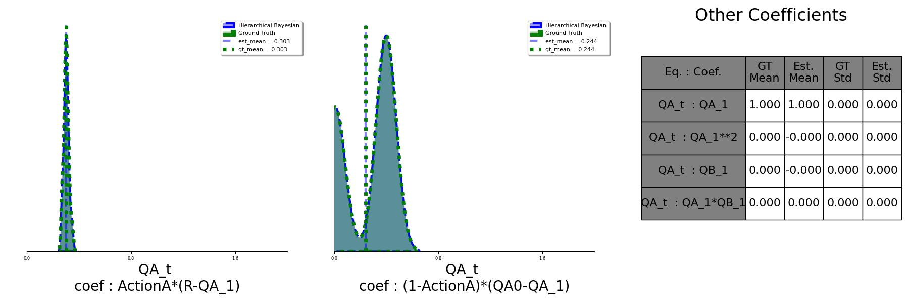

# Introduction

Understanding individual differences in dynamical systems across experimental paradigms remains a fundamental challenge. Traditional modeling approaches often assume a fixed model structure, allowing for variations only in parameter values. However, the true underlying model may differ not only in parameter magnitudes but also in structure across observational conditions.

To address this limitation, we introduce a novel method that integrates **Bayesian hierarchical inference** with the **sparse identification of nonlinear dynamical systems (SINDy)**. This approach enables the discovery of distinct dynamical mechanisms within a wide range of individuals.

Here we show how we applied this method to cognitive science. Our approach infers a distribution over model structures while inducing sparsity, allowing us to identify shared and individual-specific mechanisms. The results show that key statistical properties of the synthesized data are accurately recovered, demonstrating the method’s promise in capturing structural differences in processes.

A key application of AI in science is the development of data-driven methods for discovering the governing models of dynamical systems. One of the major challenges is accounting for differences between individuals, where an "individual" could be a human, a different environmental location, or a specific circuit. When considering these differences, it is necessary to move beyond a single, universal model.

---
## Method 
SINDy recovers dynamical equations from time-series data by expressing derivatives $\dot{X}$ as sparse linear combinations of possibly non-linear equation terms $\Theta(X)\Xi$ \citep{brunton2016discovering}. Sparsity in $\Xi$ identifies a small subset of candidate terms needed to fit the time series. Bayesian SINDy extends this approach to noisy data, inferring posterior distributions over coefficients and inducing sparsity via priors such as the regularized Horseshoe \citep{hirsh2022sparsifying}. However, this approach assumes a single model structure if data is pooled from multiple instances of a system, treating system variability as parameter noise. To capture structural variability across system instances (``individuals''), we propose hierarchical Bayesian SINDy illustrated in Figure \ref{fig:placeholder}. Each individual $i$ is modeled as

$$
    \dot{X}_i = \Theta(X_i)\Xi_i + \eta Z_i,
$$

where coefficients $\Xi_i$ are drawn from population-level distributions over candidate equation terms. This hierarchical prior allows terms to be present in some individuals but absent in others, Each individual $i$ is modeled as

$$
    \dot{X}_i = \Theta(X_i)\Xi_i + \eta Z_i,
$$

where coefficients $\Xi_i$ are drawn from population-level distributions over candidate equation terms. For this population-level $\Xi \sim \mathcal{N}( \Xi_\text{mean},\Xi_\text{Std.})$ where $\Xi_\text{mean}\sim \mathcal{Horseshoe Dist.}$ and $\Xi_\text{std}\sim\mathcal{Half-Normal}$. 
Horseshoe as prior enforce sparsity at both individual and population levels. The resulting posterior distributions capture shared structure across system instances, individual-specific variations, and even multimodal structures.

# Cognetive Reinforcement Learning   
In this repo, we see the implementation of this method for cognitive reinforcement Learning.

## Problem 
In the RL approach to explain the data of the decision-making task, we use the choice, the reward, and a latent variable, q-value to explain the mechanism of making a decision.   

    

The deck with a greater value of Q-value is more probable to be selected.   
The Q-value at a trial or experiment is related to its previous values. Different mechanisms could affect the new Q-value. Some of them are:

These mechanisms are different between different participants.   

  

Some of them are:
- Shared, exist, and have the same coefficient or magnitude
- Shared, exist, with different coefficient or magnitude
- Shared, doesn't exist for all participants
- Non-shared, means that it exists for some individuals and doesn't exist for others.  

  

---
# Results
We applieed this method to a condition that the learning mechanism is shared among individuals, but the forget mechanism is a Non-shared mechanism. 
Here you can see the result of our approach.

As it is visible it can recover the ground truth distribution. Even it can capture its multi-modality form.

  

  

We could see that both mean and standard deviation matched their corresponding ground truth values.   

We also compared the results of Flat Bayesian SINDy and Hierachical approach:
  
| Model | ELPD-LOO | WAIC |
|---|----------|---|
| Hierarchical Bayesian | 90158.9  | 90158.8 |
| Flat Bayesian | 20959.1  | 20959.1 |

  

